### Configuración (grep -v "^#" /etc/dhcp/dhcpd.conf)
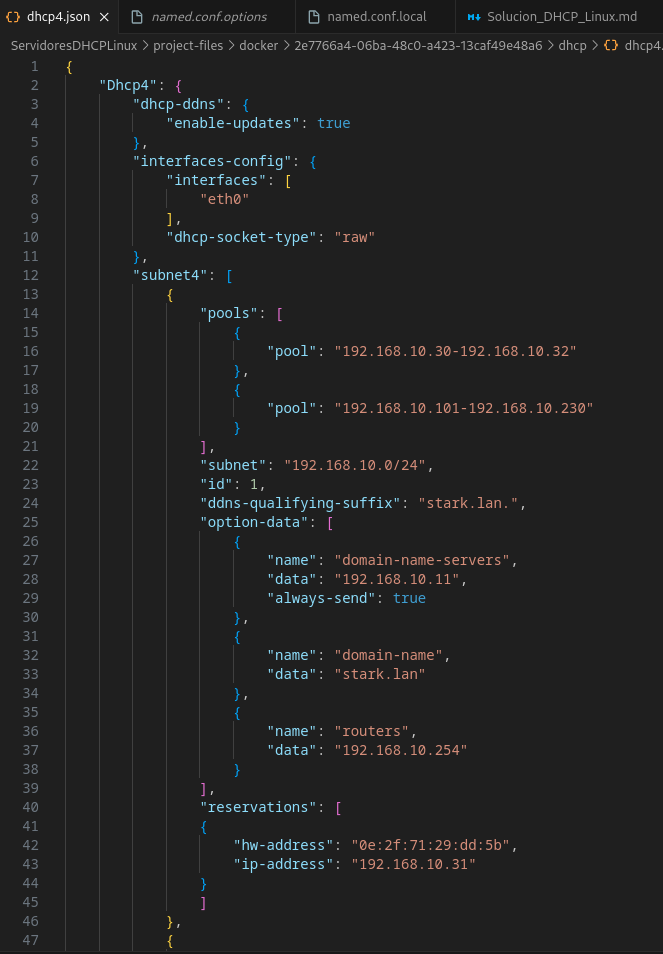

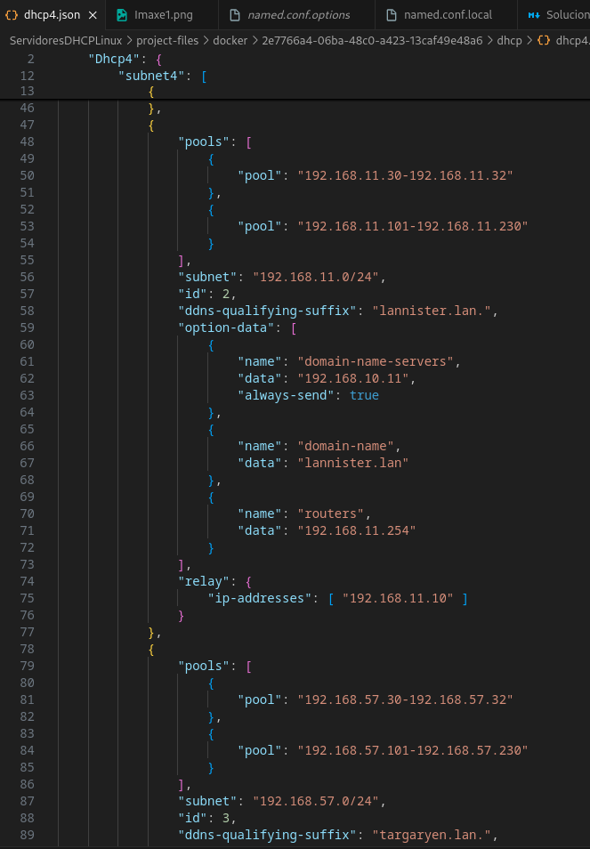

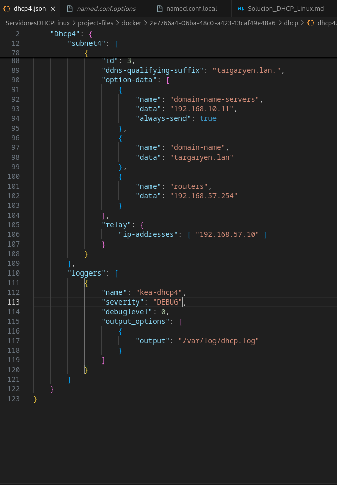

### log de ned visualizando a asignación de enderezos en cada un dos pool e da reserva estática
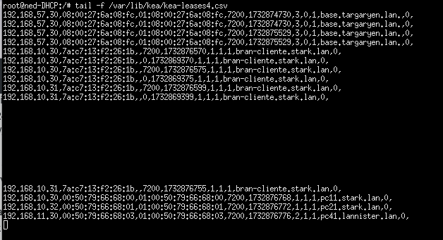

### Configuración de servidores DNS, router e enderezo IP de cada cliente
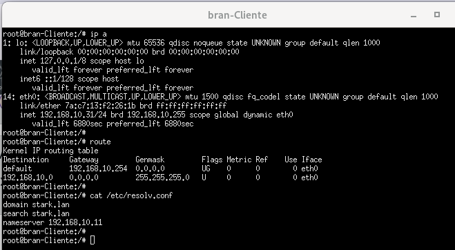

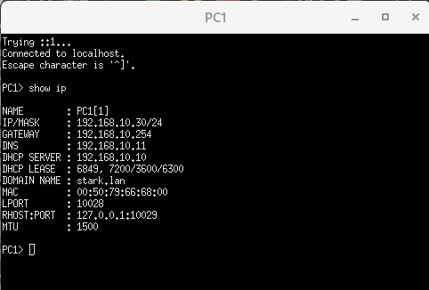

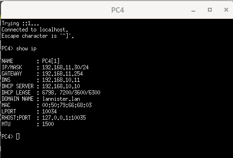

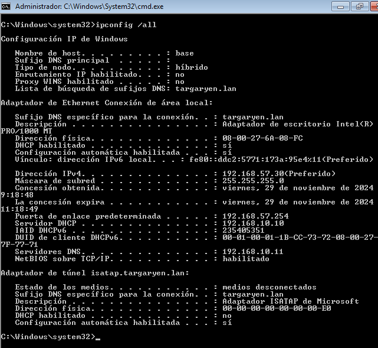

### log de ned e robb (simultáneos) facendo unha actualización mediante chaves en arya.
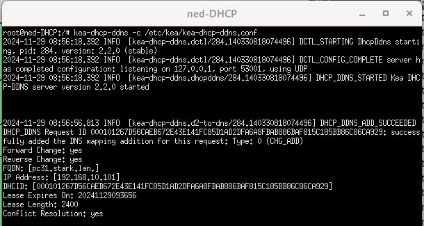

### log de ned visualizando asignacións da segunda subrede (lannister) e actualizacións no servidor dns correspondente.
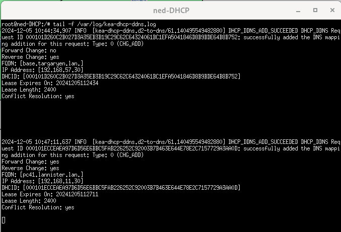

### Log dos dous servidores failover cando dous clientes obteñen enderezos
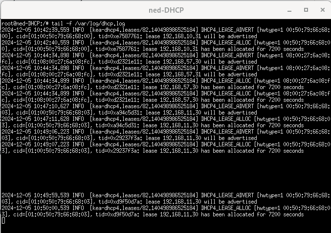

### Clientes tres dúas subredes, amosando DNS, router e enderezo IP.

